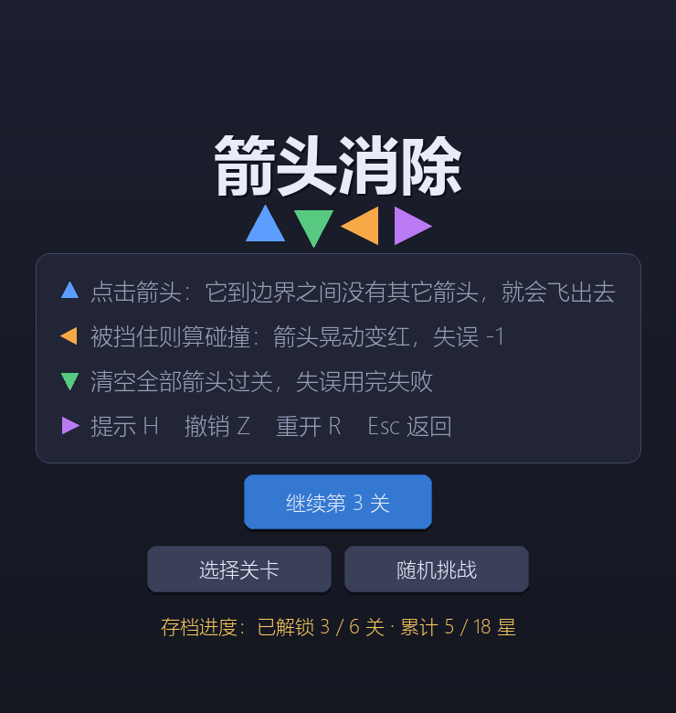
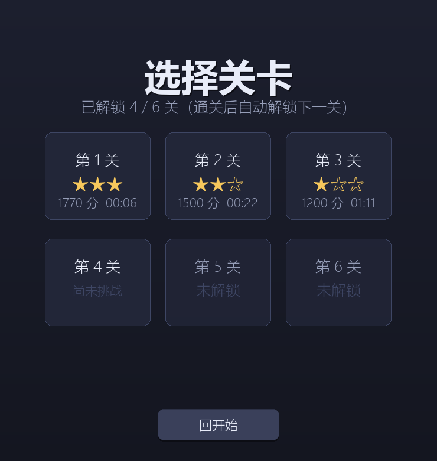
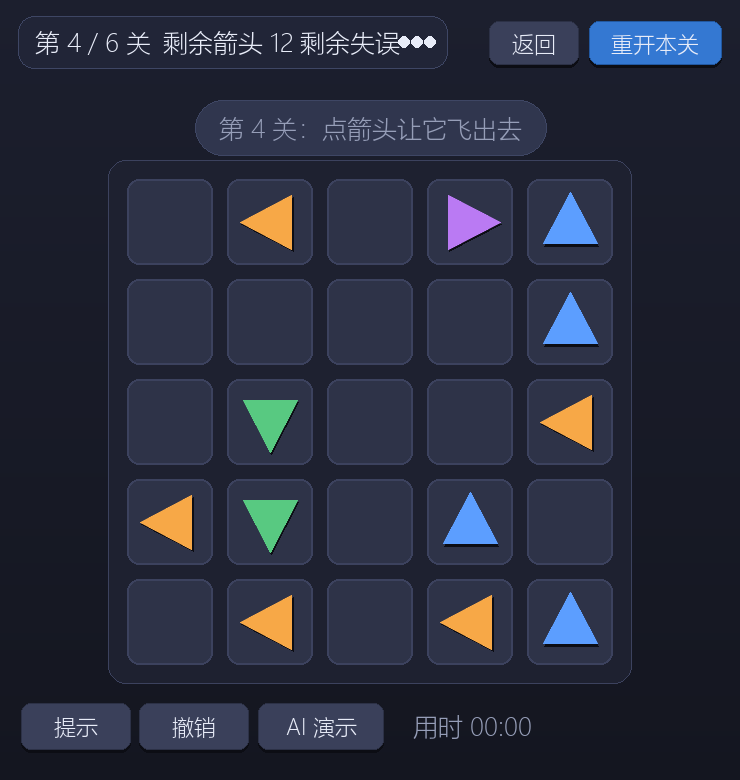
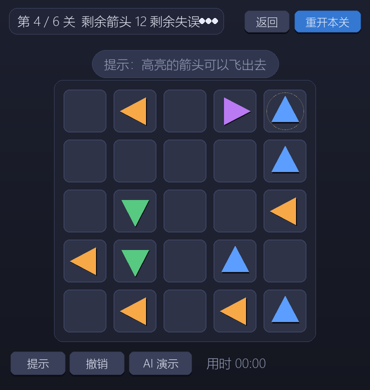
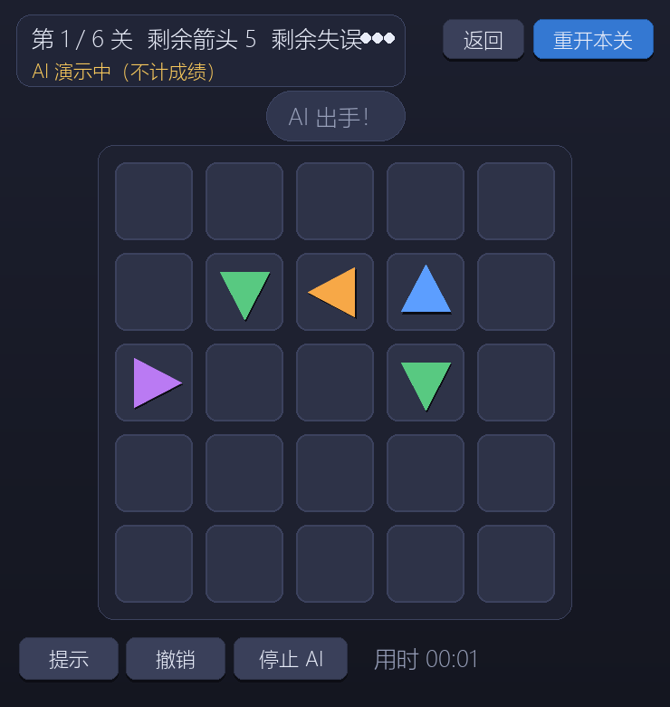

# 箭头消除

一个用 Python + pygame 实现的轻量益智小游戏：点掉棋盘上所有箭头即可过关。

点击箭头后，程序检查它前进方向到棋盘边界之间是否还有别的箭头：没有阻挡就飞出棋盘消失，有阻挡则算碰撞、原地晃动变红并扣一次失误。清空全部箭头过关，失误耗尽失败。

## 游戏截图

| 开始界面 | 关卡选择 |
|---|---|
|  |  |

| 游戏界面 | 提示高亮 |
|---|---|
|  |  |

| AI 演示 | 通关结算 |
|---|---|
|  |  |

## 运行方式

环境要求：Python 3.11+、pygame。

用 [uv](https://docs.astral.sh/uv/)（推荐，依赖已锁定在 `uv.lock`）：

```bash
uv run python main.py
```

用 pip + 虚拟环境：

```bash
python -m venv .venv
.venv\Scripts\activate        # Windows
pip install -r requirements.txt
python main.py
```

## 玩法规则

- 棋盘为 5×5 网格，每支箭头占一个格子，方向分上、下、左、右四种。
- 点击一支箭头：沿它的方向检查同一行或同一列、箭头与边界之间是否还有其它箭头。
- 没有阻挡：箭头飞出棋盘并消失。
- 有阻挡：箭头原地晃动变红，剩余失误 -1。
- 清空当前关全部箭头进入下一关；失误耗尽本关失败，可重开。
- 共 6 关，箭头数依次为 6 / 8 / 10 / 12 / 14 / 16，每关 3 次失误。

## 功能特性

基础要求之外，还实现了 7 项扩展功能：

| 功能 | 说明 |
|---|---|
| 关卡选择 | 6 个关卡卡片，未解锁的置灰；显示各关星级、得分与最好用时 |
| 计时得分 | 关卡内实时计时；结算按箭头数、剩余失误、用时计算得分与三星评价 |
| 提示 | 高亮一支当前可飞的箭头（免费不限次） |
| 撤销 | 撤销上一步成功飞出的箭头（不限次，只退成功步） |
| 保存进度 | 解锁关卡与每关最好成绩存入项目内 `save.json`；开始界面显示进度摘要，有存档时主按钮变为「继续第 N 关」，通关结算提示新纪录 |
| 随机挑战 | 现场生成一关（构造上保证可通关、不会死局） |
| AI 演示 | 按贪心策略自动通关当前关卡，演示期间不计成绩 |

## 快捷键

| 按键 | 作用 |
|---|---|
| `Esc` | 返回上一层界面（开始界面按 `Esc` 直接退出） |
| `R` | 重开本关 |
| `H` | 提示（高亮一支可飞箭头） |
| `Z` | 撤销上一步成功飞出 |

## 项目结构

```
game/
├── main.py                 程序入口
├── test_smoke.py           无头自动化测试（331 项）
├── requirements.txt
└── arrow/                  游戏包
    ├── game.py             Game 类：状态机、事件、动画更新与胜负判定
    ├── config/             全局配置
    │   ├── layout.py       窗口 / 棋盘 / 字体大小 / 各界面锚点
    │   ├── palette.py      颜色表
    │   └── rules.py        规则、评分与状态机常量
    ├── levels/             关卡数据（每关一个模块，__init__ 汇总为 LEVELS）
    ├── core/               纯逻辑层（不依赖 pygame，可单独测试）
    │   ├── logic.py        箭头模型、盘面构建、路径检测、飞出距离
    │   ├── generator.py    随机关卡生成（保证可通关）
    │   ├── solver.py       可飞判定与贪心求解（提示 / AI 共用）
    │   ├── scoring.py      星级、得分与时间格式化
    │   ├── save.py         JSON 存档（解锁进度与最好成绩）
    │   └── utils.py        颜色插值
    └── view/               表现层（依赖 pygame）
        ├── screens.py      各界面绘制
        ├── ui.py           箭头 / 面板 / 文字 / 背景绘制工具
        ├── animations.py   飞出与碰撞动画
        ├── button.py       按钮控件
        └── button_layout.py 各状态的按钮与关卡卡片布局
```

`core/` 完全不 import pygame，规则与算法逻辑可以直接在无显示环境下测试和复用。

## 运行测试

```bash
uv run python test_smoke.py
```

测试为无头运行（`SDL_VIDEODRIVER=dummy`），不需要显示器，覆盖通关流程、路径检测、动画、渲染、关卡数据、失败窗口、扩展功能与真实入口主循环，全部通过时输出：

```
SMOKE OK：331 项检查全部通过
```

## 开发说明

### 关卡数据格式

每关是一个箭头定义列表，一支箭头写成一个元组 `(方向, 行, 列)`：

```python
# arrow/levels/level1.py
from arrow.config import DOWN, LEFT, RIGHT, UP

LEVEL = [
    (LEFT, 1, 2),
    (DOWN, 1, 1),
    ...
]
```

新增关卡：在 `arrow/levels/` 下新建 `levelN.py`，然后在 `arrow/levels/__init__.py` 的 `LEVELS` 列表里追加即可。

关卡建议用「倒序摆盘」方式生成：从空盘开始，按点击顺序的**倒序**逐支摆放箭头，每摆一支都要求此刻它可以飞出去。这样构造出的盘面必然可通关——任何时刻「最后摆放的那支存活箭头」一定可飞，按编号从大到小贪心点击即可清空（`arrow/core/generator.py` 就是这个思路）。

### 调整分辨率与布局

窗口尺寸、格子像素、字号、各界面元素位置全部集中在 `arrow/config/layout.py`；按钮尺寸与位置在 `arrow/view/button_layout.py` 顶部。改分辨率时只需修改这些常量，绘制与测试会同步跟随。

### 存档

存档默认写在项目根目录 `save.json`（已在 `.gitignore` 中排除）。文件缺失或损坏时会自动回退到默认进度，不会中断游戏。存档在界面上有明确反馈：开始界面底部显示「已解锁 X / 6 关 · 累计 Y / 18 星」，有进度时主按钮变为「继续第 N 关」；通关结算显示「新纪录！成绩已保存」等提示。
